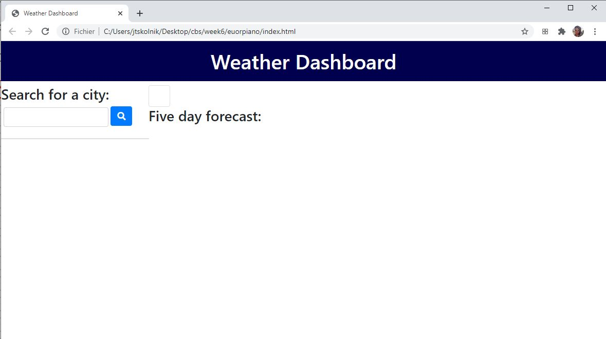
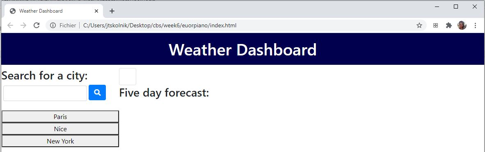
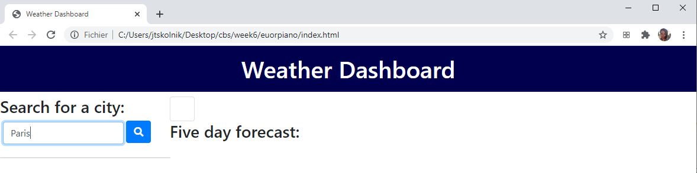
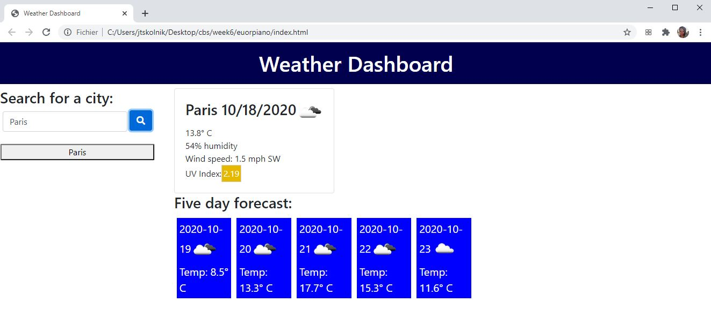
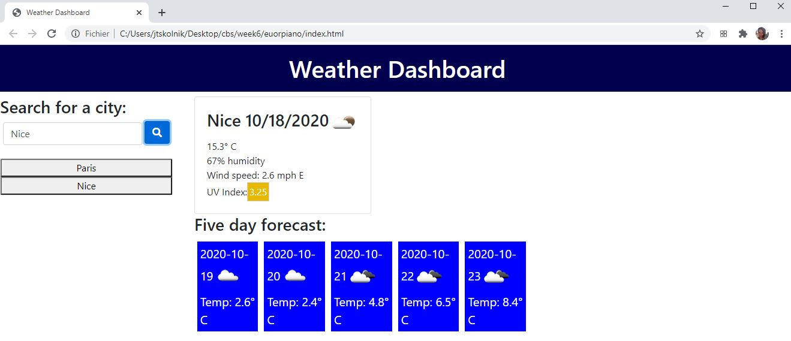

# euorpiano

## Overview

In this program, the user will initially be presented with a mostly blank screen. The user can then search for a city, and the current weather as well as the five day forecast will be displayed. This then creates a button for that city such that if the user looks for a different city, he or she can find it by clicking the button. The buttons will also auto-populate based on previous use of the application. 

[Here is a link to the deployed application](https://skolnikskolnik.github.io/euorpiano/)

### Screenshots

If there is nothing in local storage, user is greeted with:

If there are entries from local storage, user is greeted with

Then user can enter a city:

The weather is displayed:

This creates a card so the user can easily access that city's weather:

#### Development overview

1. The containers for the buttons, the weather, and the five day forecast are in the HTML, with the initial visibility of the five day forecase being none. 

2. When the user selects a city, two different ajax calls are made, one which gets the current weather and one which gets the forecast. Those elements are displayed onto the screen. 

3. Once a city has been searched, it is added to local storage and a button is created on the side

4. When the buttons are clicked, they trigger the same ajax calls as if the user had entered the city again

Areas for future improvement:

1. As of now, if a user enters an invalid city or misspells the city, an error will appear

2. If the user searches the same city twice, for example "Paris", and then "Paris" again, there will be two identical buttons that both function, but the screen will appear to be redundant